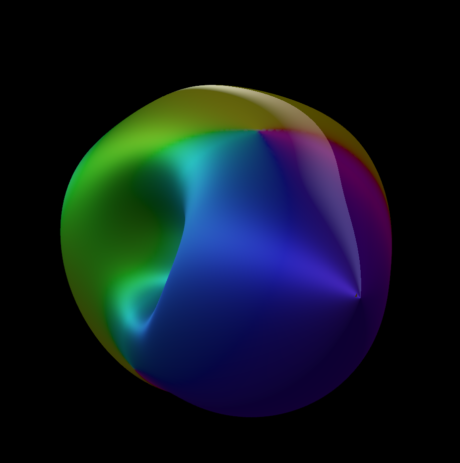

**************************************
Tutorial
**************************************

Some Expensive Computation
==========================

Remember that before compiling any you will need to have sourced env.sh
in your environment::

Open the cuda/tutorial directory under your CUDA application. You will see
there a typical CUDA project structure. In particular, ``device.gpr`` will build
the code running on the device, ``host.gpr`` the code on the host. The Makefile
is responsible to build both project, note that it's using the standard Makefile.build
structure. If you open cuda/Makefile.build, you'll see both build commands:

.. code-block:: Makefile

    gprbuild -Xcuda_host=$(CUDA_HOST) -P device
	gprbuild -Xcuda_host=$(CUDA_HOST) -P host -largs $(CURDIR)/lib/*.fatbin.o

The argument ``-Xcuda_host=$(CUDA_HOST)`` is here to allow to build for cross
platform such as ARM Linux. In this tutorial, we're only going to build for native
X86 Linux so they could be ignored.

One key argument on the host compilation command line is
``-largs $(CURDIR)/lib/*.fatbin.o`` which is adding to the list of object files that
the host is linking against the object code containing device binary to load on
the GPU.

You can make and run the application:

.. code-block::

    $> make && ./main

You should see some timing output, e.g.:

.. code-block::

    Host processing took  0.021741000 seconds
    Device processing took  0.000000000 seconds

This project is doing some expensive computations in O(3) complexity, on an array
of size of 2^8 by default. Device processing isn't implemented yet which explains
the 0 result. You can change the size of the analysis by adding a parameter
on main command line, e.g.:

.. code-block::

    $> ./main 9
    Host processing took  1.303823000 seconds
    Device processing took  0.000000000 seconds

These number depend on your platform. You should find a value that process data around 1
second to make the next steps meaningful.

This code is currently fully native and single treaded. We're going to offload
the computation to the GPU.

Open ``src/common/kernel.ads``. You'll see the specification of ``Native_Complex_Computation``:

.. code-block:: ada

  procedure Native_Complex_Computation
     (A : Float_Array;
      B : Float_Array;
      C : out Float_Array;
      I : Integer);

We're going to wrap this call into a CUDA kernel that can be called directly
from the host.

The first thing is to create types. Ada array types cannot be passed directly
from host to device - they need to be passed through specific access types
marked as addressing device memory space. This is done by using a specific
aspect on the type ``Designated_Storage_Model => CUDA.Storage_Models.Model``.
When set, allocation and deallocation are done through CUDA API allocators.
Copies betwen these pointers and native pointers will also be instrumented
to be able to move device data to the host and back.

Introduce a new pointer type in the ``Kernel`` package:

.. code-block:: ada

    type Array_Device_Access is access Float_Array
       with Designated_Storage_Model => CUDA.Storage_Models.Model;

Note that this pointer has to be pool specific - e.g. it can't have the ``all``
Ada reservered word. That means that it conceptually points to a specific
pool of data - the device memory - and that conversions with other
pointers types are not allowed.

We're now going to introduce a procedure that can be called from the host. In
CUDA world, this is called a kernel. Kernels are identified by a special aspect,
``CUDA_Global`` which corresponds to the ``__global__`` modifier used in C CUDA
code. This kernel will take A, B and C as parameter. The specific index I is
not needed at the kernel level and will be computed in the kernel.

Write the kernel specification:

.. code-block:: ada

   procedure Device_Complex_Computation
     (A : Array_Device_Access;
      B : Array_Device_Access;
      C : Array_Device_Access)
     with CUDA_Global;

We're now going to implement the kernel. Open ``kernel.adb`` and start the body
of the function:

.. code-block:: ada

   procedure Device_Complex_Computation
     (A : Array_Device_Access;
      B : Array_Device_Access;
      C : Array_Device_Access)
    is
    begin
       null;
    end Device_Complex_Computation;

This kernel will be be called in parallel, once per index in the array to
compute. Within a kernel, it's possible to index a given call using the
thread number (``Thread_IDx``) and the block number (``Block_IDx``). You
can also retreive the number of thread in a block that have been scheduled
(``Block_Dim``) and the number of blocks in the grid (``Grid_Dim``). These
are 3 dimension values, indexed by x, y and z. In this example, we're only
going to use the x dimension.

Add computation of the Index I in the body of the kernel based on the block
and thread index:

.. code-block:: ada

   I : Integer := Integer (Block_Dim.X * Block_IDx.X + Thread_IDx.X);

Note that these are expressed in terms of Interfaces.C.int, so the result
needs to be converted explicly to Integer.

From there, the call to ``Native_Complex_Computation`` is trivial. The whole
kernel should now look like:

.. code-block:: ada

   procedure Device_Complex_Computation
     (A : Array_Device_Access;
      B : Array_Device_Access;
      C : Array_Device_Access)
   is
      I : Integer := Integer (Block_Dim.X * Block_IDx.X + Thread_IDx.X);
   begin
      Native_Complex_Computation (A.all, B.all, C.all, I);
   end Device_Complex_Computation;

We're done with the kernel - let's move to the host code. Open ``src/host/main.adb``.
This code currently allocates three native arrays ``H_A``, ``H_B`` and ``H_C`` and runs
computation on it. We're going to introduce three new arrays, ``D_A``, ``D_B``, ``D_C``
type after ``Array_Device_Access`` created earlier.

Introduce the new declarations:

.. code-block:: ada

    D_A, D_B, D_C : Array_Device_Access;

We're now going to decide on how kernel calls will be scheduled on the GPU.
In this tutorial, we're going to set each block to contain 256 threads.
The number of blocks to cover the entire array can be deduced from this,
essentiallize ``Number_Of_Elements / Threads_Per_Block``, adding 1 to
account for potenntial portions of the Threads_Per_Block size.

Introduce computations for ``Threads_Per_Block`` and ``Blocks_Per_Grid``:

.. code-block:: ada

   Threads_Per_Block : Integer := 256;
   Blocks_Per_Grid : Integer := Num_Elements / Threads_Per_Block + 1;

We now need to allocate memory on the device side. In order to compute the actual
additional cost of device computation, this allocation will be taken into account
in the total time reported. Indeed, data copy can be a critical limiting factor
of GPU performance enhancements.

Indentify the portion of the body marked ``-- INSERT HERE DEVICE CALL``. Introduce
here two array allocations and copies for H_A and H_B to D_A and D_B respectively.
Also allocate one array to D_C to be the size of H_C:

.. code-block:: ada

   D_A := new Float_Array'(H_A.all);
   D_B := new Float_Array'(H_B.all);
   D_C := new Float_Array (H_C.all'Range);

Note that the three statements above are using the storage model instrumentation
introduced before. In particular, allocation are done through the CUDA API, and
copies will happen through the CUDA API from the host to the device.

Now is time to finally call our kernel code! These special calls are done through
a special pragma, ``CUDA_Execute``, which takes at least 3 parameters: a procedure
call to a kernel, the dimensions of the blocks (how many threads they contain) and
one for the grid (how many block it contains).

Introduce the CUDA call:

.. code-block:: ada

   pragma CUDA_Execute
     (Device_Complex_Computation (D_A, D_B, D_C),
      Threads_Per_Block,
      Blocks_Per_Grid);

When hitting that pragma, ``Device_Complex_Computation`` will be scheduled to be
executed Blocks_Per_Grid * Threads_Per_Block times on the kernel. This call is
non blocking by itself - subsequent dependent operations (such as copies from the
device) will actually be.

Let's actually introduce this copy now. Results are going to be stored in D_C, let's
copy it to H_C:

.. code-block:: ada

    H_C.all := D_C.all;

This is a copy between a host and a device pointer, which will be instrumented to
retreive device memory to the host.

The whole sequence should look like:

.. code-block:: ada

   D_A := new Float_Array'(H_A.all);
   D_B := new Float_Array'(H_B.all);
   D_C := new Float_Array (H_C.all'Range);

   pragma CUDA_Execute
     (Device_Complex_Computation (D_A, D_B, D_C),
      Threads_Per_Block,
      Blocks_Per_Grid);

   H_C.all := D_C.all;

That's it! As an extra exercise, you might want to instanciate and call
``Ada.Unchecked_Deallocation`` on the device pointers, but that's not
strickly necessary. Compile and run the code. You can try different
values for the array size to observe differences. For example:

.. code-block::

    ./main 10
    Host processing took  1.227895000 seconds
    Device processing took  0.051606000 seconds

Marching Cubes
==============

You can see a full fetch example with some more interesting computation in the
marching cubes example. Marching cubes is one of the typical algorithms in graphical
rendering. It allows you to convert a density function, able to separate absence of
presence of a material in a continuous 3D space, into a mesh of triangles. This algorithm
is a transcription of the algoritm details in NVIDIA's `Metaballs GPU Gem 3 manual
<https://developer.nvidia.com/gpugems/gpugems3/part-i-geometry/chapter-1-generating-complex-procedural-terrains-using-gpu>`_.
In this example, we'll define a density function through `Metaballs <https://en.wikipedia.org/wiki/Metaballs>`_

To be able to build and run the example, ensure that you have the following
dependencies installed:

- SDL
- OpenGL

You can build and run the code the same way as other examples:

.. code-block::

    cd cuda/examples/marching
    make
    ./main

This should open a window and display metaballs on the screen moving around.
The speed of the rendering will be dependent on the GPU power available on
your system. This can be adjusted by changing the sampling of the grid that
computes marching cubes - the smaller the sampling the faster the computation.
You can adust that by changing the value under ``src/common/data.ads``::

.. code-block:: ada

    Samples : constant Integer := 256;

Try for example 128 or 64. This value needs to be a power of 2.

Walkthrough of this code goes beyond the scope of this tutorial, but it's
a good place to start looking at more complex usage of the technology.
